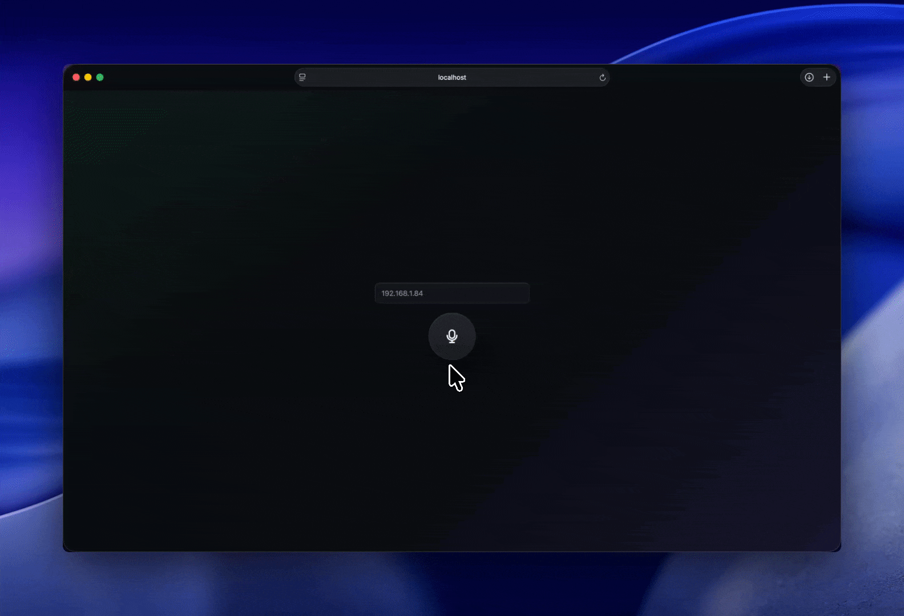

<p align="center"><strong>Voice Bridge</strong> зажал, сказал, отпустил
<p align="center">
  
</p>
</br>
</p

---

## Как это работает

1. Открываешь фронт
2. Вводишь IP ESP32
3. Зажимаешь кнопку микрофона
4. Говоришь
5. Отпускаешь
6. Браузер отправляет звук на ESP32

Аудио отправляется одним готовым буфером, без стриминга.
Зеленая подсветка сигнализует об успешной отправке, красная нет.

## API

```text
POST http://<esp32-ip>/audio
Content-Type: application/octet-stream
```

## Формат аудио

```text
PCM
Int16
mono`
8000 Hz
little-endian
```

Примерно так:

[120, -340, 900, 1024, -88, ...]

## Укажи Wi-Fi сеть

```cpp
static const char *WIFI_SSID = "<YOUR_WIFI>";
static const char *WIFI_PASSWORD = "<YOUR_PASSWORD>";
```

После прошивки открой Serial Monitor на `115200`.

```shell
IP address: <esp32-ip>
```
